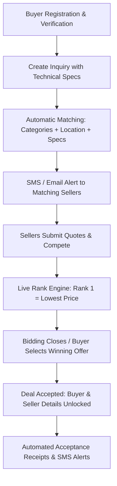

# DND Purchase — Project Overview & Architecture Documentation

## 1. Executive Summary

**DND Purchase** is a B2B reverse-auction marketplace designed to streamline and automate the procurement of industrial building materials—primarily **Steel** (TMT Rebars, Pipes-Tubes-Hollow Sections, HR Plates/Coils, GP-GI Coils/Purlins, Color-coated Coils/Sheets, Bare Galvalume, Beam/Column/Channel/Angle) and **Cement**.

The platform connects verified **Buyers** (contractors, builders, industrial consumers) with verified **Sellers** (manufacturers, authorized distributors, stockists) across India. It features anonymous bidding, automated supplier-inquiry matching based on location and product capabilities, reverse-auction bidding timers, ranking engines, and automated SMS/Email workflows.

---

## 2. Technology Stack

### Frontend & Application Framework
- **Framework**: [Next.js 16 (App Router)](https://nextjs.org/)
- **UI Library**: [React 19](https://react.dev/)
- **Styling**: [Tailwind CSS](https://tailwindcss.com/) with CSS variables and glassmorphic / dark-theme styling
- **Component Primitives**: [Radix UI](https://www.radix-ui.com/) (`@radix-ui/react-*`)
- **Animation**: [Framer Motion](https://www.framer.com/motion/)
- **Icons**: [Lucide React](https://lucide.dev/)
- **Notifications / Toasts**: [Sonner](https://sonner.emilkowal.ski/)
- **Forms & Validation**: [React Hook Form](https://react-hook-form.com/) & [Zod](https://zod.dev/)

### Backend, Database & Infrastructure
- **Database**: [Cloud Firestore](https://firebase.google.com/docs/firestore) (NoSQL realtime database)
- **Authentication**: [Firebase Authentication](https://firebase.google.com/docs/auth) (Email/Password + Google OAuth)
- **File Storage**: [Firebase Storage](https://firebase.google.com/docs/storage) (GST certificates, Aadhaar cards, quotation PDFs, spec sheets)
- **SMS Gateway**: [MSG91 Flow Builder](https://msg91.com/) for DLT-compliant transactional SMS
- **Email Service**: [Nodemailer](https://nodemailer.com/) with Google Workspace SMTP / AWS SES support
- **Hosting / Deployment**: [Vercel](https://vercel.com/) / Firebase

---

## 3. User Roles & Identity Model

### 1. Buyer (`role: "buyer"`)
- **ID Format**: `BUY-XXXX` (User Code: `BXXX`, Public Alias: `Buyer-XXX`)
- Can create single or multi-item inquiries.
- Defines technical parameters (dimensions, thickness, grade, coating, make, quantity, payment terms, delivery location).
- Receives competitive bids from verified sellers within a set bidding window.
- Views ranked bids (Rank 1 = lowest price) and accepts the preferred offer.
- Full seller contact information is revealed upon deal acceptance.

### 2. Seller (`role: "seller"`)
- **ID Format**: `SEL-XXXX` (User Code: `SXXX`, Public Alias: `Seller-XXX`)
- Configures product catalog (`categories`, `product_manufacturers`, `seller_product_options`) and service locations (`available_locations`).
- Automatically notified when an inquiry matches their product specifications and operational districts.
- Submits price per ton / unit quotations, terms, and attachments before the bidding window closes.
- Sees live competition rank (e.g., Rank 1, Rank 2) and can revise quotes during the bidding period.
- Receives buyer contact details once their offer is accepted.

### 3. Dual Role (`role: "both"`)
- Allows users to switch between Buyer and Seller workspaces using a single set of credentials.

### Anonymity & Privacy Principle
- All buyers and sellers remain strictly anonymous (displayed as `Buyer-001`, `Seller-005`) throughout the active inquiry and bidding stages to prevent off-platform collusion.
- Real company and contact details (name, company, phone, email, delivery address) are automatically unlocked **only after an offer is officially accepted**.

---

## 4. Key Workflows & System Modules



### 4.1 Verification & Onboarding
- **Company Verification**: Requires GSTIN validation and upload of GST Certificate document.
- **Individual Verification**: Requires 12-digit Aadhaar number (validated using the **Verhoeff algorithm**) and Aadhaar PDF/image document upload.
- **Email Verification**: Primary and secondary notification emails with verification flags.

### 4.2 Dynamic Product & Specification Engine
- Products are stored dynamically in Firestore (`products` collection).
- Each product has configured fields (`product_options` collection) with buyer input types (`dropdown`, `checkbox`, `radio`, `number`, `text`, `table`) and seller lock types.
- Field labels with helper instructions (e.g., `Dimension (Example: 40×20)`) are sanitized in inquiry views to display clean names (e.g., `Dimension`).

### 4.3 Inquiries & Reverse Auction Bidding
1. **Creation**: Buyer adds items to inquiry stack, sets delivery location, payment terms, and bidding duration (e.g. 1 hour to several days).
2. **Matching Engine**: Inquiries match sellers whose configured `categories` contain the product, whose `available_locations` cover the delivery state/district, and whose `seller_product_options` match the required variants/makes.
3. **Bidding Window**: Sellers submit price per unit/ton and comments. Ranks recalculate in real-time (`updateOfferRanks`).
4. **Offer Acceptance**: Buyer accepts the best quote, which transitions the offer to `accepted` and marks competing offers as `rejected` or `disqualified`.

### 4.4 Non-Standard Color-Coated Coils Catalog
- Specialized module for non-standard/stock color-coated coils (`Stock of non-standard Color-coated coils/sheets`).
- Sellers list available coils/sheets by RAL color series, tonnage, location, and comments.
- Buyers can browse live stock and contact sellers directly for ready-to-dispatch inventory.

### 4.5 Communications & Notifications
- **MSG91 Flow Builder SMS**:
  - `Welcome_SMS`: Sent upon registration.
  - `New_inquiry_alert`: Broadcast to matched sellers when a relevant inquiry goes live.
  - `Bidding_Started`: Notifies participants that bidding is open.
  - `New_Offer`: Alerts the buyer when a new bid is placed.
  - `Offer_Accepted_Buyer` & `Offer_Accepted_Seller`: Notifies both parties with reciprocal contact details.
  - `Offer_Rejected_Seller`: Alerts non-winning bidders.
  - `Inquiry_closed`: Alerts sellers when an inquiry ends or is cancelled.
- **Email Receipts**:
  - HTML formatted submission receipts, quotation summaries, and accepted offer contact exchanges via Nodemailer / AWS SES.

---

## 5. Database Architecture (Firestore)

| Collection | Document ID | Purpose |
| :--- | :--- | :--- |
| `buyers` | `BUY-XXXX` | Buyer profiles, entity type, verification status, contact info. |
| `sellers` | `SEL-XXXX` | Seller profiles, product catalog, options, locations, verification. |
| `products` | Numeric ID | Product definitions (TMT Rebars, Pipes, Cement, etc.) and sub-products. |
| `product_options` | Auto ID | Option specifications (Grade, Coating, Manufacturer, Dimension, etc.). |
| `locations` | State ID | States and districts mapping for delivery routing. |
| `inquiries` | `INQ-XXXX` | Inquiries submitted by buyers, status, location, bidding deadlines. |
| `inquiry_items` | `ITEM-XXXX` | Line items belonging to an inquiry with specific attributes. |
| `offers` | `OFR-XXXX` | Seller quotations, price per ton, rank, status, attachments. |
| `settings` | `location` / etc. | Global application configuration and location rules. |

---

## 6. Directory Structure Overview

```
DnDPurchase/
├── app/                        # Next.js App Router
│   ├── api/                    # Serverless API routes
│   │   ├── analytics/          # Platform metrics
│   │   ├── auth/               # Login, register, Google OAuth
│   │   ├── inquiries/          # Inquiry CRUD & status handlers
│   │   ├── locations/          # State/district lookup
│   │   ├── offers/             # Quotation submission & acceptance
│   │   ├── products/           # Dynamic product definitions & options
│   │   ├── upload/             # Cloud storage uploads (PDFs, docs)
│   │   ├── user/               # Profile updates & password resets
│   │   └── verify/             # GSTIN & Aadhaar validation
│   ├── auth/                   # Authentication pages (login, register, reset)
│   ├── dashboard/              # Protected application views
│   │   ├── inquiries/          # Buyer's submitted inquiries
│   │   ├── inquiry/new/        # 2-step inquiry builder modal
│   │   ├── offers/             # Buyer's received offers & rank management
│   │   ├── seller/             # Seller portal (pending inquiries, submitted bids, catalog)
│   │   └── settings/           # Profile & notification preferences
│   ├── tutorials/              # User training and guide videos
│   ├── globals.css             # Design tokens, themes & utilities
│   └── layout.tsx              # Root layout, theme providers & fonts
├── components/                 # Reusable UI components & Radix wrappers
├── lib/                        # Core utilities & database SDK
│   ├── aadhaar-verhoeff.ts     # Verhoeff checksum algorithm for Aadhaar validation
│   ├── auth-context.tsx        # Global user authentication React Context
│   ├── email.ts                # Nodemailer / AWS SES email dispatchers
│   ├── firebase.ts             # Firebase app, db, auth, and storage initialization
│   ├── logger.ts               # Structured logging utility
│   ├── sms.ts                  # MSG91 Flow API SMS integration
│   ├── store.ts                # Firestore queries, mutations, data mappers & business logic
│   └── utils.ts                # Label formatting, sorting, and className helpers
├── public/                     # Static assets, logos, and icons
├── scripts/                    # Maintenance & utility scripts
├── firestore-rules.txt         # Firestore security rules reference
└── package.json                # Project dependencies & npm scripts
```
